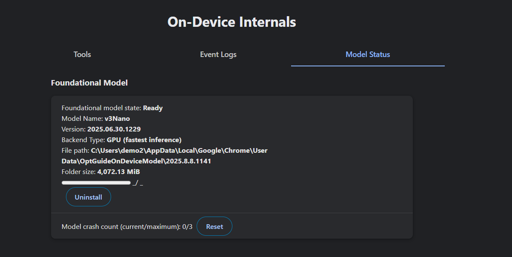

# Nexus Local AI Framework

A production-grade, local-first AI chatbot framework built with React and Vite. Nexus Chat is designed to be a high-performance, modular UI that interfaces seamlessly with both built-in browser AI (Chrome Prompt API / Gemini Nano) and external local LLM servers (like Ollama and LM Studio).

## Features

- **Premium Glassmorphic UI**: A stunning, custom-designed interface featuring radial mesh gradients, glass panels, and smooth CSS animations.
- **Local-First Architecture**: Connects directly to `window.ai` (Chrome Gemini Nano) for zero-latency, offline inferences.
- **External Provider Support**: Built-in support for OpenAI-compatible local endpoints (Ollama, LM Studio) with dynamic model fetching.
- **Robust Conversation Management**: Persists chats using IndexedDB. Supports global importing/exporting, as well as renaming, deleting, and Markdown exports of individual sessions.
- **Advanced Controls**: Edit your previous prompts or seamlessly regenerate AI responses.
- **File Attachments**: Instantly inject context by attaching `.js`, `.py`, `.txt`, and `.md` files directly into your prompt.
- **Push-to-Talk (STT)**: Use your microphone to speak your messages - displays animated visual feedback.
- **Collapsible Sidebar**: Toggle between full sidebar and compact icon-only mode.

## Project Structure

```
nexus-chat/
├── index.html
├── package.json
├── vite.config.js
└── src/
    ├── main.jsx
    ├── App.jsx
    ├── index.css                 # Global styles and glassmorphic theme variables
    ├── hooks/
    │   └── useVoice.js          # Voice hooks for STT/TTS
    ├── components/
    │   ├── Sidebar.jsx          # Chat history and session management UI
    │   ├── ChatArea.jsx         # Main chat interface, message bubbles, and input
    │   ├── SettingsModal.jsx    # Configuration for providers, themes, and global prompts
    │   └── VoiceOverlay.jsx     # Voice visual overlay
    └── lib/
        ├── db.js                 # IndexedDB wrapper for local chat persistence
        └── providers/
            ├── ProviderManager.js   # Orchestrates active AI providers
            ├── ChromeAIProvider.js  # Interfaces with Chrome's experimental window.ai
            └── OpenAIProvider.js    # Connects to local servers like Ollama/LM Studio
```

## Getting Started

### 1. Install dependencies

```bash
npm install
```

### 2. Run the development server

```bash
npm run dev
```

### 3. Chrome window.ai Setup

Ensure you are using Chrome 127+ and have the following flags enabled via `chrome://flags`:
- `#enable-experimental-web-platform-features`
- `#optimization-guide-on-device-model`
- `#prompt-api-for-gemini-nano`

To verify the model is available, visit `chrome://on-device-internals/` and check the **Model Status** tab. You should see "Ready" next to Gemini Nano.



### 4. Select the Model

In the chat input area, click the sparkles icon (✨) next to the send button and select **"Gemini Nano (Built-in)"** to use the local Chrome AI.

### 5. Ollama Setup (Optional)

- Install Ollama and pull a model (e.g., `ollama run llama3`).
- Open Nexus Chat Settings, switch the provider to "OpenAI Compatible API".
- Your local models will automatically populate in the dropdown.

---

## Important: Chrome AI Model Not Available?

### ⚠️ WARNING: If you cannot find the Chrome/Gemini Nano model or it shows as unavailable

This is a known issue where Chrome's on-device AI model doesn't automatically download or register properly.

**Solution:**
1. **Uninstall Chrome** completely
2. **Delete all Chrome data** - make sure to clean all remaining files (location varies by OS)
3. **Reinstall Chrome** fresh
4. Open Chrome and ensure you're signed in (sync helps with AI features)
5. Visit `chrome://ai` to check if the model is now available
6. The model should auto-download after a short while

This issue was personally encountered and resolved by doing a clean reinstall. Sometimes the model fails to download automatically, and a fresh install is the only reliable fix.

---

## Building for Production

```bash
npm run build
```

The built files will be in the `dist/` folder.